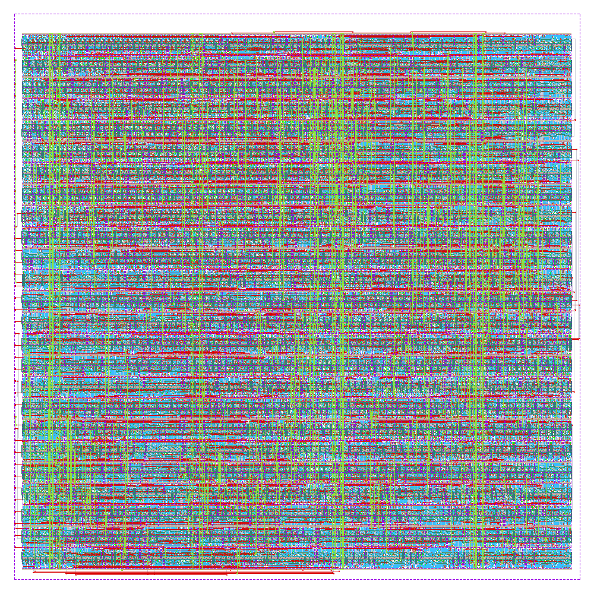

<!--
SPDX-FileCopyrightText: © 2026 HeiScore Authors
SPDX-License-Identifier: Apache-2.0

Render with Marp:
  npx @marp-team/marp-cli@latest docs/slides.md --pdf
  npx @marp-team/marp-cli@latest docs/slides.md --html
  npx @marp-team/marp-cli@latest -s docs        # live preview server
-->

<!-- _class: lead -->

# HeiScore

## Pong in silicon — without writing RTL

**heichips26_heiscore** · HeiChips 2026 · IHP SG13G2 (`ihp-sg13cmos5l`)

Georg Gläser · Nils Stanislawski

<span class="small">200 µm × 200 µm tiny slot · 25 MHz · DRC/LVS/antenna clean</span>

---

## What it is

A complete Pong machine on 0.04 mm² of silicon — no CPU, no framebuffer, no external memory.

- **VGA 640 × 480 @ 60 Hz**, generated pixel by pixel from a 25 MHz clock
- Bouncing **ball** with a 10 × 10 colour bitmap, two **paddles**, playfield **frame**
- Two **7-segment scores**; hitting the left or right wall scores for the other player, first to 10 restarts the match
- Output is 1 bit per colour channel on `uo_out`, in **TinyVGA Pmod** pin order — plug a Pmod on the chip's IOs and it is on screen
- ***

## The twist: there is no Verilog source

The design is **written in Python** with [`nortl`](https://pypi.org/project/nortl/) and _emitted_ as SystemVerilog.

```python
def build() -> Engine:
    engine = Engine('heiscore_engine')
    pong = Pong(engine, Const(0), Const(0), Const(1))
    timer = engine.create_timer()

    with engine.fork('display_thread'):      # pixel sink, free running
        VGA(engine, pong).run()

    with engine.fork('main_loop'):           # game clock
        with engine.while_loop(Const(True)):
            timer.wait_delay(20000)          # 800 µs @ 25 MHz
            pong.tick()
    return engine
```

`src/heiscore/top.py` is the **single** design definition — tapeout, FPGA bitstreams, simulation and the equivalence check all build from it.

---

## How the picture is built

Every object answers three questions for a pixel position: **visible? colour? type?**

<div class="cols">
<div>

```python
class Box(GraphicsObject):
    def visible(self, x, y):
        return All(x >= self.lx, y >= self.ly,
                   x <  self.ux, y <  self.uy)
```

A `GraphicsStash` groups objects and resolves them front to back — that is the whole "PPU".

</div>
<div>

- **No framebuffer**: the scene is a combinational function of `(x, y)`
- The same function feeds the **collision** logic — the ball asks the scene what it is about to touch
- The game state is ~110 flip-flops; everything else is logic

</div>
</div>

`src/heiscore/` → `make rtl` → `rtl/generated/heiscore_engine.sv` (911 lines) → LibreLane → GDS

---

## Chip integration

```systemverilog
heiscore_engine i_engine (
    .CLK_I(clk), .RST_ASYNC_I(~rst_n),
    .red(vga_r), .green(vga_g), .blue(vga_b),
    .hsync(vga_hsync), .vsync(vga_vsync)
);
assign uo_out = {vga_hsync, vga_b, vga_g, vga_r,
                 vga_vsync, vga_b, vga_g, vga_r};   // TinyVGA Pmod order
```

- `rtl/heichips26_heiscore.sv` is the **only** hand-written HDL: a pin wrapper on the standard HeiChips interface (`ui_in`, `uo_out`, `uio_*`, `ena`, `clk`, `rst_n`)
- Everything below the instance is generated
- `uio_*` unused, tri-stated — the eFPGA can route `uo_out` wherever the demo needs it

---

## The layout

<div class="cols">
<div>



</div>
<div>

|             |                          |
| ----------- | ------------------------ |
| Die         | 200 × 200 µm (tiny slot) |
| PDK         | IHP `ihp-sg13cmos5l`     |
| Clock       | 25 MHz (40 ns)           |
| Std cells   | 1 859 (+ 1 916 fill)     |
| Flip-flops  | 110                      |
| Utilization | 62.6 %                   |
| Routing     | Metal1–Metal4            |
| Power       | 211 µW @ 1.2 V, 25 °C    |

</div>
</div>

---

## Signoff

| Check                   | Result                                        |
| ----------------------- | --------------------------------------------- |
| Magic DRC / KLayout DRC | **0 errors**                                  |
| LVS (netgen)            | **Circuits match uniquely**                   |
| Antenna                 | **0 violations**, 0 diodes needed             |
| Zero-area polygons      | 0                                             |
| Setup / hold, 3 corners | **0 violations** — WNS +30.2 ns, WHS +0.26 ns |
| Max slew / max cap      | 0 violations                                  |
| IR drop                 | 0.15 mV worst case                            |

<span class="small">Corners: nom_typ 1.20 V 25 °C, nom_slow 1.08 V 125 °C, nom_fast 1.32 V −40 °C. One max-fanout warning remains, with no timing impact at 25 MHz. Reports live in <code>verification/</code>.</span>

---

## Verification


**IMS Arcade** adds what the tiny slot has no pins for:

- We have pytest :D
  - Test for Ball dynamics
  - There is VGA-Playground
  - We have an FPGA

We want to complete the verification with Verilator by comparing VGA signals from pre- to postlayout.


---

## It already runs — on FPGA

<div class="cols">
<div>

Olimex GateMate with IMS Arcade hat

</div>
<div>

**IMS Arcade** adds what the tiny slot has no pins for:

- 2 × 4 **key matrix** scan for four paddle keys
- **ILI9341 LCD** panel driven in parallel with VGA
- One scene, two sinks — a `Viewport` maps the 640 × 480 master space onto the panel's 320 × 240 raster with pure wiring, no line buffer

</div>
</div>
